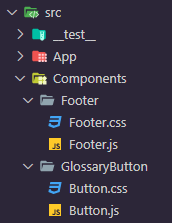

## Front End

### React

The front end was created using React as a framework. React is a JavaScript library for building user interfaces:

- Declarative: React makes it painless to create interactive UIs. Design simple views for each state in your application, and React will efficiently update and render just the right components when your data changes. Declarative views make your code more predictable, simpler to understand, and easier to debug.
- Component-Based: Build encapsulated components that manage their state, then compose them to make complex UIs. Since component logic is written in JavaScript instead of templates, you can easily pass rich data through your app and keep the state out of the DOM.

Get started with [React](https://reactjs.org/docs/getting-started.html).

---

### Component Tree

For each component, create a folder within the 'Components' folder and hav a .js and corresponding .css file within it.

- src
    - Components
        - 'New Component' Folder
            - newcomponent.css
            - newcomponent.js

---

### CSS

The hex colours used for CSS are listed below: 

| Color             | Hex                                                                |
| ----------------- | ------------------------------------------------------------------ |
| Rich Black |  #000814 |
| Oxford Blue |  #001d3d |
| Prussian Blue |  #003566 |
| Yale Blue |  #004a8f |
| Mikado Yellow |  #ffc300 |
| Gold Web Golden |  #ffd60a |

> Font used is Helvetica

---

### Flexbox

Flexbox is used within the CSS to style the pages. 

Flexbox [guide](https://css-tricks.com/snippets/css/a-guide-to-flexbox/) for reference.

